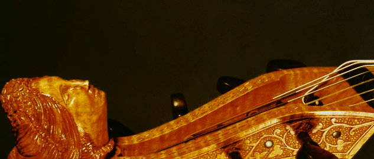

# Viola Da Gamba

---

fretted bowed instruments spun with gut  

came up from mid to late 15th century and were most popular in the Renaissance and Baroque periods.  
[here](https://en.wikipedia.org/wiki/Viol) you'll find more info

i took the samples from  
[Bigcat Instruments](http://bigcatinstruments.blogspot.com/2014/08/gm-midi-instruments-for-kontakt.html)

and i was pleased to have fun making a sfz of the viol-samples  
playable with sfz-player like <a href="https://www.plogue.com/products/sforzando.html" target="sfo">sforzando</a> from <a href="https://www.plogue.com/" target="plg">plogue</a>  

it is a simple instrument and coud be used to fill up content when it needs to, maybe never  

[Download](sfz/violadagamba.zip)  

--
Besides my dubious efforts, there is a much better version of viols (more than one) in the package  
[Early Music Ensemble (v3)](https://www.dropbox.com/s/v94z8sruj7yh0by/Early%20Music%20Ensemble%20%28v3%29%20SFZ%20Files.zip?dl=0)
made by [Arianna Cunningham](https://www.youtube.com/channel/UCoSBT4PeH0fxfvA0zQUxWRw/about) for [Musescore](https://musescore.org/)

----

[Viola Da Gamba](https://bobobo-git.github.io/SFZ-Viola-Da-Gamba/) <a style="float:right;" href="https://github.com/bobobo-git/SFZ-Viola-Da-Gamba/">.</a>
